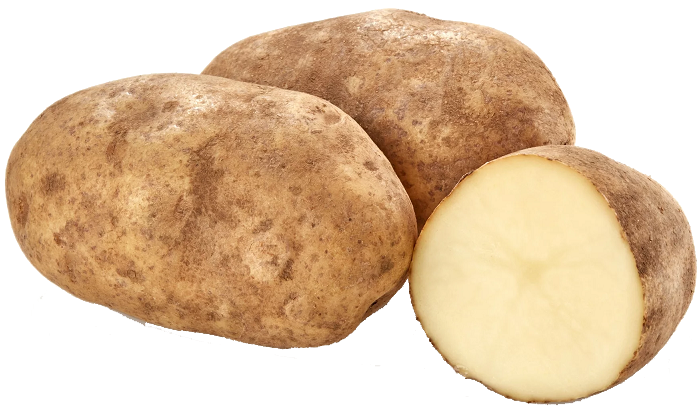

# cs2-dom-intro

# Learning Target
I am learning how to use the Document Object Model to control HTML with JavaScript

# Success Criteria
- I can store an HTML element in a variable using ```getElementById()```
- I can change the text of an HTML element using ```innerText```
- I can create a click counter app

# Project Setup
1. Install *Live Server*
2. Create ```script.js```
3. Add ```console.log("Script started")``` to begining of ```script.js```
4. Add ```<script src="script.js"></script>``` before ```</body>``` tag in ```index.html``` to link the script
5. Go live and use the inspection tool to check that you see ***Script started*** in the console to verify your script is linked correctly to your html 

# Essential Notes
- The **Document Object Model (DOM)** is how web browsers organize all the webpage elements created by HTML tags to be controlled with JavaScript
- Use ```let someElement = document.getElementById("some-id");``` to store a webpage element in a variable
- Use ```someElement.innerText = "some text";``` to change the text of an element
- Use ```let someVariable = someElement.innerText;``` to store the text of an element into a JS variable

# Click Counter Example
Refresh your page and check the console for messages after each step
1. Create an ```<h1>``` in ```index.html``` with the id ```click-display``` underneath the image
    ```html
    <h1 id="click-display">Click counter</h1>
    ```
2. In ```script.js```, create variable to track the number of clicks
    ```javascript
    // Variable to track the number of clicks
    let clicks = 0;
    ```
3. Store the click display h1 in a variable using ```getElementById```
    ```javascript
    // Variable to store the click display h1 element
    let clickDisplay = document.getElementById("click-display");
    ```
4. Set the initial text of the click display h1 using ```innerText```
    ```javascript
    // Set the initial text for click count h1
    countDisplay.innerText = "Clicks: " + clicks; 
    ```  
5. Define a function to call when the image is clicked. Add ```console.log("click");``` inside the function
    ```javascript
    // Called each time the image is clicked
    function handleClick() {
        console.log("click");
    }
    ```
6. Add the ```onclick``` attribute to the image to call your ```handleClick()``` function when the image is clicked
    ```html
    
    ```
7. Update the function to add one to the ```clicks``` variable and update the click display h1
    ```javascript
    // Called each time the image is clicked
    function handleClick() {
        console.log("click");
        // Add one to click count
        clicks = clicks + 1;
        // Update click count display h1
        countDisplay.innerText = "Clicks: " + clicks;
    }
    ```

# Exercise: Upgrade the click counter app
Let's add some levels and upgrades to the click counter. To start, let's make it so that after 10 clicks, the user reaches level 2 and each click is now worth 2 clicks. Once you understand how to make a second level, you can add more levels!
## Part 1: Detect when they reach 10 clicks and tell the user
1. Use an if statement to check when ```clicks``` is equal to 10, then use ```alert()``` to display a pop-up notification
2. Add another ```<h1>``` tag to your ```index.html``` and give it the id ```level-display```
3. Update your if statement to set the text of the level-display to **Level 2** when they reach 10 clicks

## Part 2: Make each click worth two clicks
1. Declare a variable named ```clickValue``` underneath ```clicks``` and assign it the initial value ```1```
2. Update ```handleClick()``` so that instead of adding ```1``` to ```clicks```, you add the variable ```clickValue``` to ```clicks```. This way, if we change the ```clickValue``` to ```2```, two will be added to the number clicks each time. Then, later, we could add more levels and each click could be worth 5, 10, 20, etc.
3. Update your if statement to set ```clickValue``` to ```2``` when they reach 10 clicks

## Part 3: Add a third level
After 50 clicks, the user reaches level 3 and each click is now worth 5 clicks.
1. Add an ```else if``` block under your if statement to check when ```clicks``` is equal to 50
2. Again, use ```alert()``` to display a pop-up, update level display h1, and set ```clickValue``` to ```5```

## Part 4: Make it look better
I have already setup a ```styles.css``` file with selectors for the different elements.
- Set a ```background-color```
- Set ```font-family```, ```color```, and ```font-size```
- Adjust the size (```width```) of the image
- Center the elements
